<h1 align="center">🏥𝙲𝚑𝚊𝚕𝚕𝚎𝚗𝚐𝚎 - 𝙷𝚘𝚜𝚙𝚒𝚝𝚊𝚕 𝚂𝚊𝚋𝚊𝚛𝚊́🏥</h1>
 
 

**𝘔𝘢𝘤𝘳𝘰 𝘗𝘳𝘰𝘫𝘦𝘵𝘰👩‍⚕️**

A nutrição hospitalar enfrenta desafios crescentes devido ao aumento da demanda e às rigorosas exigências relacionadas à alimentação. No Hospital Infantil Sabará, uma referência em pediatria em São Paulo, problemas como ineficiência operacional, falhas na comunicação, acúmulo de responsabilidades e dificuldades logísticas impactam diretamente a qualidade do atendimento.

**𝘗𝘳𝘪𝘯𝘤𝘪𝘱𝘢𝘪𝘴 𝘗𝘳𝘰𝘣𝘭𝘦𝘮𝘢𝘴 𝘐𝘥𝘦𝘯𝘵𝘪𝘧𝘪𝘤𝘢𝘥𝘰𝘴**:

- Ausência de sistemas de automação.
- Desorganização no deslocamento de suprimentos e alimentos.
- Sobrecarga das enfermeiras.
- Falhas na comunicação entre profissionais e responsáveis pelos pacientes.
- Dificuldades no gerenciamento de prontuários e processos assistenciais.
- Questões relacionadas à sustentabilidade e higienização de materiais.

**𝘔𝘪𝘤𝘳𝘰 𝘗𝘳𝘰𝘫𝘦𝘵𝘰👩‍⚕️**  

𝘋𝘦𝘴𝘦𝘯𝘷𝘰𝘭𝘷𝘦𝘮𝘰𝘴 𝘶𝘮 𝘢𝘱𝘭𝘪𝘤𝘢𝘵𝘪𝘷𝘰 𝘲𝘶𝘦 𝘪𝘯𝘵𝘦𝘨𝘳𝘢 𝘧𝘶𝘯𝘤𝘪𝘰𝘯𝘢𝘭𝘪𝘥𝘢𝘥𝘦𝘴 𝘱𝘢𝘳𝘢 𝘳𝘦𝘴𝘰𝘭𝘷𝘦𝘳 𝘦𝘴𝘴𝘦𝘴 𝘱𝘳𝘰𝘣𝘭𝘦𝘮𝘢𝘴 𝘥𝘦 𝘧𝘰𝘳𝘮𝘢 𝘦𝘧𝘪𝘤𝘪𝘦𝘯𝘵𝘦 𝘦 𝘢𝘶𝘵𝘰𝘮𝘢𝘵𝘪𝘻𝘢𝘥𝘢. 𝘈𝘴 𝘱𝘳𝘪𝘯𝘤𝘪𝘱𝘢𝘪𝘴 𝘧𝘶𝘯𝘤̧𝘰̃𝘦𝘴 𝘪𝘯𝘤𝘭𝘶𝘦𝘮:

- **𝘈𝘶𝘵𝘰𝘮𝘢𝘤̧𝘢̃𝘰 𝘥𝘰 𝘱𝘭𝘢𝘯𝘦𝘫𝘢𝘮𝘦𝘯𝘵𝘰 𝘢𝘭𝘪𝘮𝘦𝘯𝘵𝘢𝘳**: Facilita o gerenciamento de dietas personalizadas para os pacientes.
- **𝘈𝘨𝘦𝘯𝘥𝘢𝘮𝘦𝘯𝘵𝘰 𝘥𝘦 𝘤𝘰𝘯𝘴𝘶𝘭𝘵𝘢𝘴**: Otimiza o atendimento entre nutricionistas e responsáveis.
- **𝘊𝘰𝘮𝘶𝘯𝘪𝘤𝘢𝘤̧𝘢̃𝘰 𝘦𝘧𝘪𝘤𝘪𝘦𝘯𝘵𝘦**: Chats privados para sanar dúvidas e ajustar exigências alimentares.
- **𝘎𝘦𝘳𝘦𝘯𝘤𝘪𝘢𝘮𝘦𝘯𝘵𝘰 𝘥𝘦 𝘱𝘦𝘥𝘪𝘥𝘰𝘴**: Suprimentos e alimentos são solicitados com maior agilidade.

**𝘐𝘮𝘱𝘢𝘤𝘵𝘰𝘴 𝘗𝘰𝘴𝘪𝘵𝘪𝘷𝘰𝘴**:

- **𝘙𝘦𝘥𝘶𝘤̧𝘢̃𝘰 𝘥𝘦 𝘢𝘵𝘳𝘢𝘴𝘰𝘴**: Entregas de refeições passaram a ocorrer pontualmente.
- **𝘔𝘢𝘪𝘰𝘳 𝘦𝘧𝘪𝘤𝘪𝘦̂𝘯𝘤𝘪𝘢**: Enfermeiros e cozinheiros têm rotinas organizadas e previsíveis.
- **𝘔𝘦𝘭𝘩𝘰𝘳𝘪𝘢 𝘯𝘢 𝘤𝘰𝘮𝘶𝘯𝘪𝘤𝘢𝘤̧𝘢̃𝘰**: Profissionais e responsáveis pelos pacientes interagem de forma clara e direta.

**𝘌𝘹𝘱𝘢𝘯𝘴𝘢̃𝘰 𝘥𝘰 𝘗𝘳𝘰𝘫𝘦𝘵𝘰**:

Com o tempo, identificou-se a necessidade de rastreamento em tempo real dos alimentos e suprimentos. Integrando a tecnologia de cartões já usados no hospital com o aplicativo, foi possível localizar itens de forma precisa, elevando ainda mais a eficiência logística e o controle operacional.

Essa solução não só otimizou processos como também promoveu uma experiência hospitalar mais segura e organizada, garantindo melhor qualidade de vida aos pacientes e maior produtividade às equipes.
   

**𝘛𝘦𝘤𝘯𝘰𝘭𝘰𝘨𝘪𝘢𝘴 𝘜𝘵𝘪𝘭𝘪𝘻𝘢𝘥𝘢𝘴🚑**  

-   : Para construção e noção basica do site desenvolvido.
-   : Para estilzação do site.
-   : Para rodamento de algumas funções do site. 
-   : Para base de inicio do site.
  

**𝘗𝘳𝘰𝘨𝘳𝘢𝘮𝘢𝘴 𝘜𝘴𝘢𝘥𝘰𝘴🚑**  

-   : Para linguagens utilizadas

-   : Para construção e noção basica do site desenvolvido.

**𝘊𝘰𝘮𝘰 𝘌𝘭𝘦𝘴 𝘍𝘶𝘯𝘤𝘪𝘰𝘯𝘢𝘮 𝘦𝘮 𝘊𝘰𝘯𝘫𝘶𝘯𝘵𝘰🚑**

O Figma funcionara como uma base visual, mas não apenas isso como ele também irá fornecer os códigos para passar para o CSS. Tendo uma base visual o HTMl será a base de estruturação do site, sendo as páginas q iremos vizualizar do site, mas a estilização estará nos códigos CSS onde cada página HTML irá ter sua própria assim como o Java Script terá a sua propria página HTML que irá de conjunto com o CSS. No site criado, o Java Script servirá para mostrar os alerts do site.

  
**𝘓𝘰𝘨𝘪𝘯🚑**  

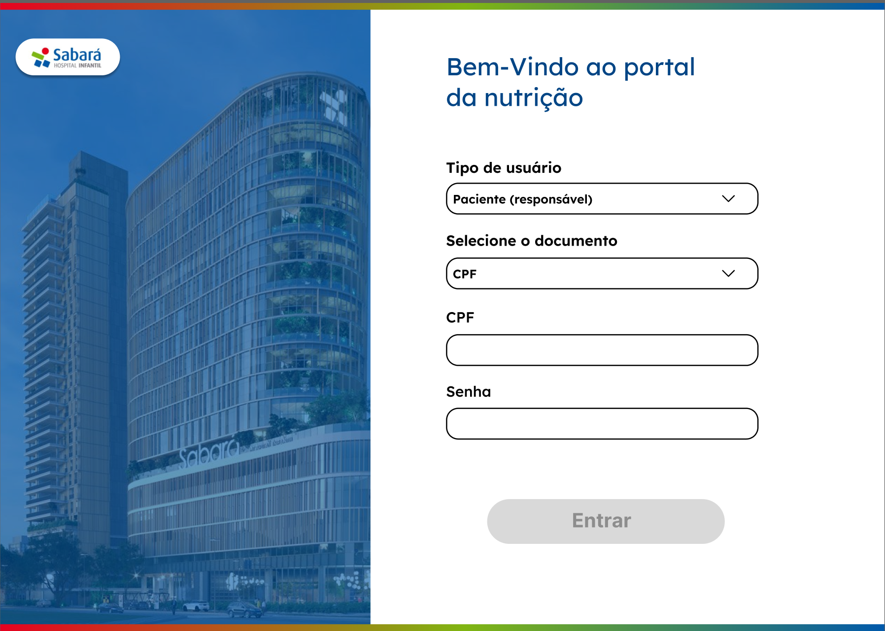

**𝘗𝘢́𝘨𝘪𝘯𝘢𝘴 𝘥𝘰 𝘙𝘦𝘴𝘱𝘰𝘯𝘴𝘢́𝘷𝘦𝘭🚑** 

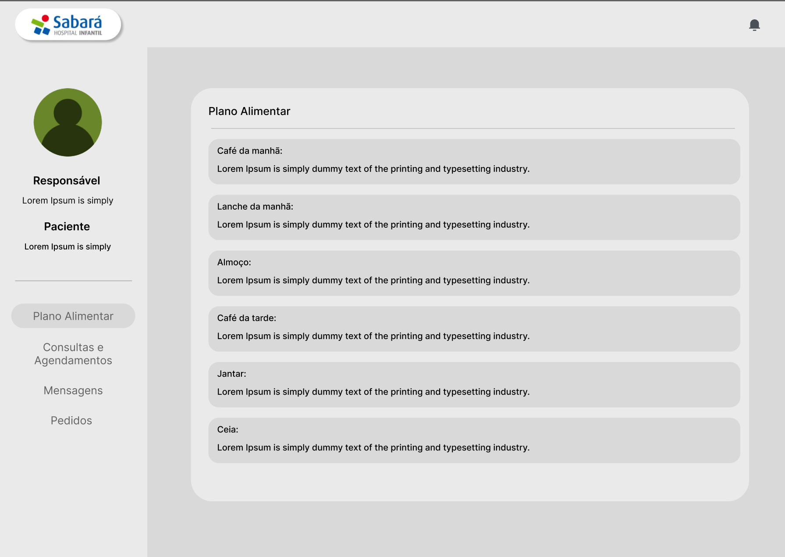

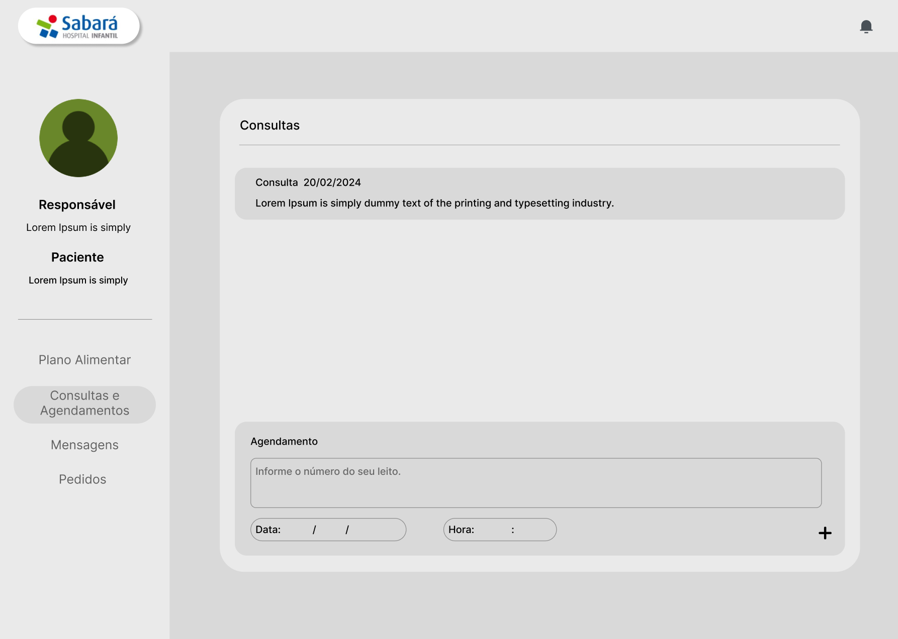

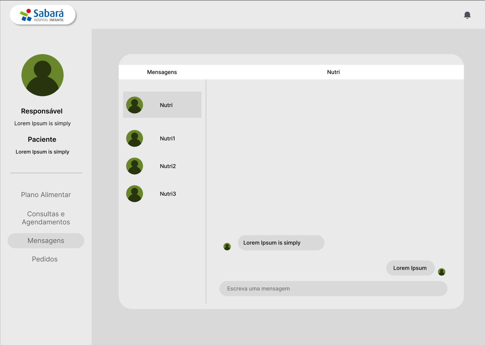

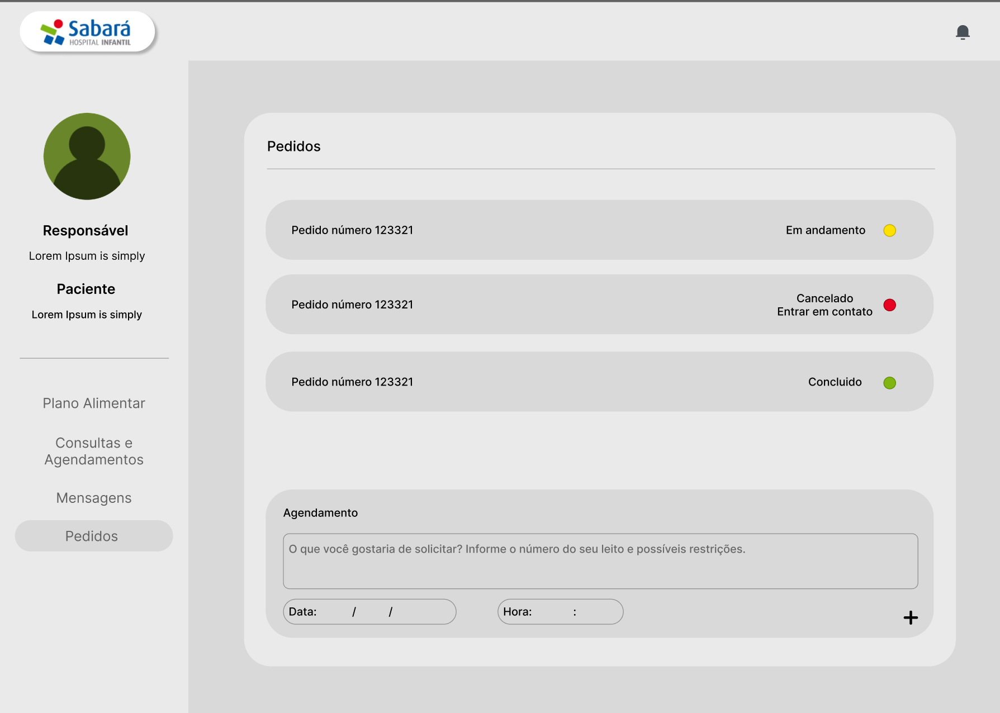

**𝘗𝘢́𝘨𝘪𝘯𝘢𝘴 𝘥𝘰 𝘗𝘳𝘰𝘧𝘪𝘴𝘴𝘪𝘰𝘯𝘢𝘭🚑** 

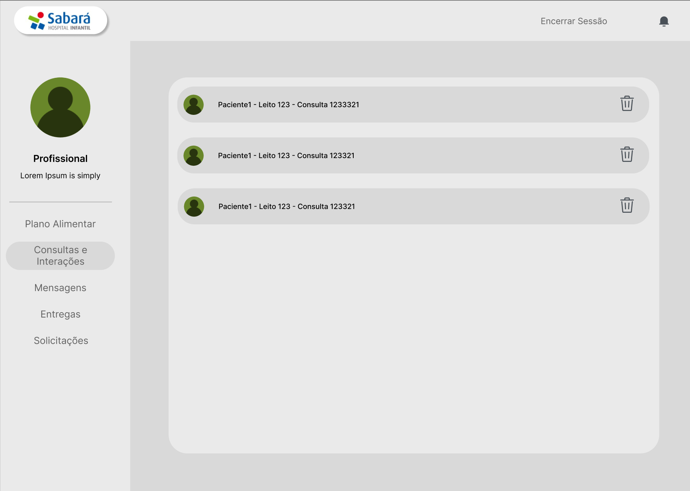

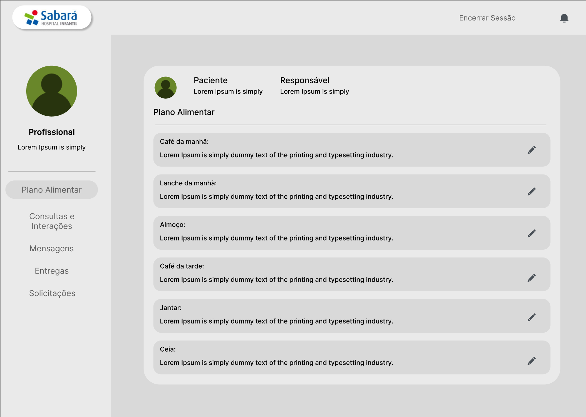

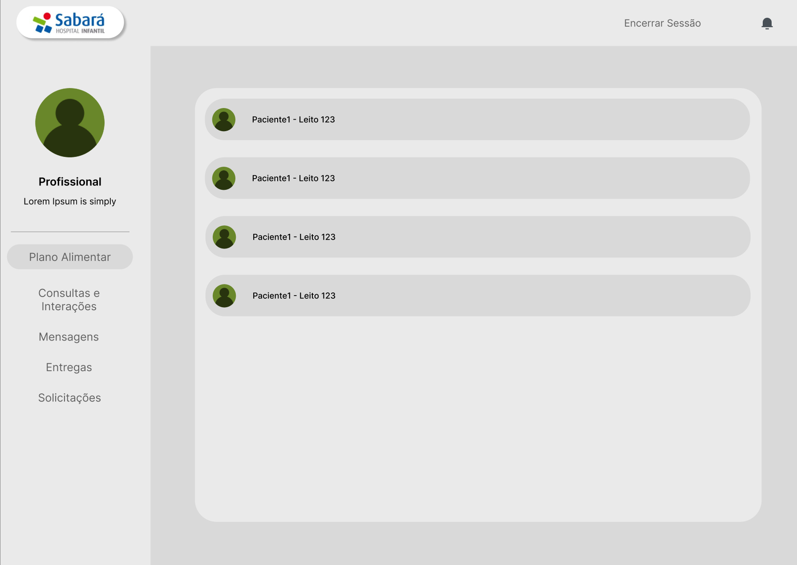

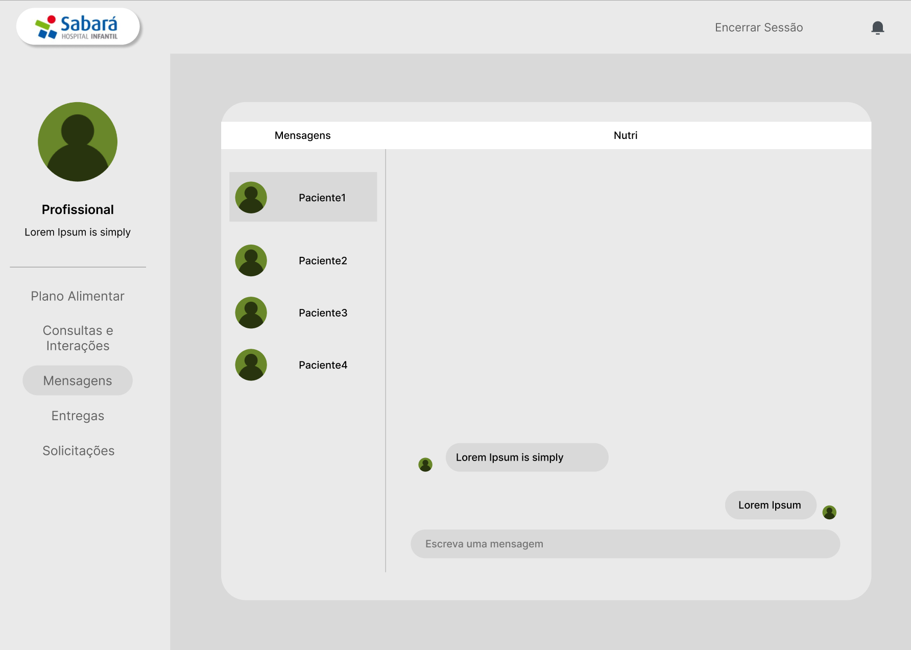

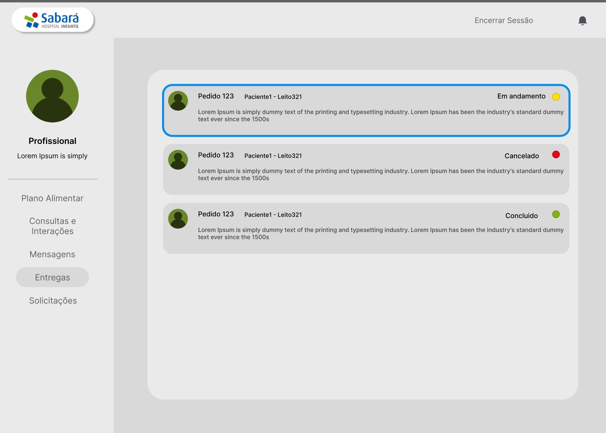

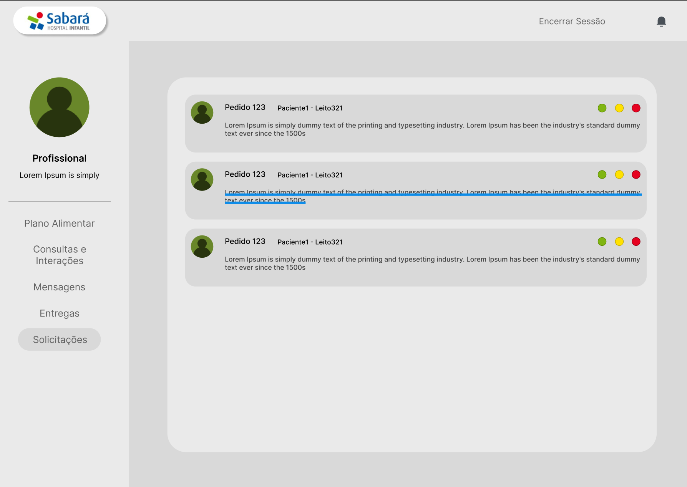

**𝘊𝘰𝘮𝘰 𝘌𝘹𝘦𝘤𝘶𝘵𝘢𝘳 𝘰 𝘗𝘳𝘰𝘫𝘦𝘵𝘰🚑**  

Link do site : [[[http://127.0.0.1:5500/](https://julikatv.github.io/global_solution_webdev_frontend/)](https://julikatv.github.io/global_solution_webdev_frontend/)](https://julikatv.github.io/global_solution_webdev_frontend/)

Para executar o projeto localmente por meio de um Fork:

1. Copie o códgo apresentado quando apertar o botão "<> Code"
2. Cole o código no seu Github desktop ou no terminal do seu VSCode utilizando "git clone url_do_repositório_do_site"
3. Depois de seguir os passos a cima clique na página index.html
4. Clique na aba superior em "View" e depois em "Explorer".
5. Caso queira um modo mais fácil de acessar o site, baixe a extensão "Live Server" ainda dentro do VSCode na aba lateral chamada "extensions" 

**𝘋𝘦𝘴𝘦𝘯𝘷𝘰𝘭𝘷𝘦𝘥𝘰𝘳𝘢𝘴 𝘥𝘰 𝘗𝘳𝘰𝘫𝘦𝘵𝘰🚑**

- 𝙶𝚊𝚋𝚛𝚒𝚎𝚕𝚊 𝚀𝚞𝚎𝚒𝚛𝚘𝚐𝚊      560035
- 𝙶𝚒𝚝𝙷𝚞𝚋    https://github.com/gabiqueiroga1
- 𝙻𝚒𝚗𝚔𝚎𝚍𝚒𝚗   https://www.linkedin.com/in/gabriela-queiroga-493260338/
  

- 𝙹𝚞𝚕𝚒𝚊 𝚂𝚊𝚢𝚞𝚛𝚒 𝚈𝚘𝚔𝚘𝚘    560541
- 𝙶𝚒𝚝𝙷𝚞𝚋    https://github.com/JulikaTV
- 𝙻𝚒𝚗𝚔𝚎𝚍𝚒𝚗   https://www.linkedin.com/in/julia-yokoo-491797215/
  

- 𝙼𝚊𝚛𝚒𝚊 𝙴𝚍𝚞𝚊𝚛𝚍𝚊 𝙵𝚎𝚛𝚛𝚎́𝚜   560418
- 𝙶𝚒𝚝𝙷𝚞𝚋    https://github.com/dudaferres
- 𝙻𝚒𝚗𝚔𝚎𝚍𝚒𝚗   https://www.linkedin.com/in/mariaeduardaferres/

**𝙻𝚒𝚌𝚎𝚗𝚌̧𝚊🏛️**  
Este projeto está licenciado sob a Licença MIT. Veja o arquivo [LICENSE](./LICENSE) para mais detalhes.
